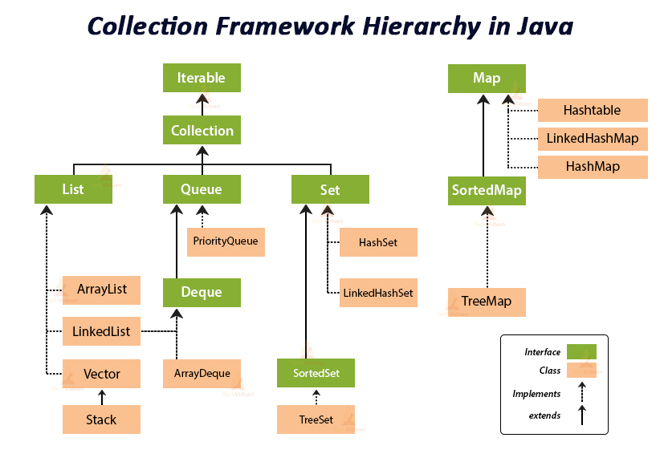

# Programación - Tipo de Datos Abstractos, Colecciones y Genéricos

Tema 06 Tipo de Datos Abstracto. 1DAM. Curso 2021/2022.


- [Programación - Tipo de Datos Abstractos, Colecciones y Genéricos](#programación---tipo-de-datos-abstractos-colecciones-y-genéricos)
  - [Tipo de Datos Abstracto](#tipo-de-datos-abstracto)
  - [Genéricos](#genéricos)
  - [Colecciones en JAVA](#colecciones-en-java)
    - [Listas](#listas)
      - [ArrayList](#arraylist)
      - [LinkedList](#linkedlist)
      - [Cola](#cola)
      - [Pila](#pila)
    - [Conjuntos](#conjuntos)
      - [HashSet](#hashset)
      - [TreeSet](#treeset)
    - [Mapas](#mapas)
      - [HashMap](#hashmap)
      - [TreeMap](#treemap)
  - [Ordenación en colecciones](#ordenación-en-colecciones)
    - [Comparable](#comparable)
    - [Comparator](#comparator)
    - [Formas de ordenar una colección](#formas-de-ordenar-una-colección)
  - [Búsqueda en colecciones](#búsqueda-en-colecciones)
  - [Recursos](#recursos)
  - [Autor](#autor)
    - [Contacto](#contacto)
      - [Agradecimientos:](#agradecimientos)

## Tipo de Datos Abstracto
Un tipo de dato abstracto (TDA) es un conjunto de datos u objetos creado de manera personalizada por un programador para un fin específico. Un TDA es una abstracción que permite modelar las características de un elemento en particular. Es por ello que es crucial definir cómo se comportará un TDA y poder reutilizarlo lo máximo posible independientemente del tipo de información que contiene.

## Genéricos
En su esencia, el término genéricos significa tipos parametrizados. Los tipos parametrizados son importantes porque le permiten crear clases, interfaces y métodos en los que el tipo de datos sobre los que operan se especifica como parámetro. Una clase, interfaz o método que funciona con un tipo de parámetro se denomina genérico, como una clase genérica o método genérico.

Una ventaja principal del código genérico es que trabajará automáticamente con el tipo de datos pasados a su parámetro de tipo. Muchos algoritmos son lógicamente los mismos, independientemente del tipo de datos a los que se apliquen. Por ejemplo, un Quicksort (algoritmo de ordenación) es el mismo si está ordenando elementos de tipo Integer, String, Object, o Hilo. Con los genéricos, puede definir un algoritmo una vez, independientemente de cualquier tipo específico de datos, y luego aplicar ese algoritmo a una amplia variedad de tipos de datos sin ningún esfuerzo adicional.

Es importante entender que Java siempre le ha dado la habilidad de crear clases, interfaces y métodos generalizados operando a través de referencias del tipo Object. El problema era que no podían hacerlo con la seguridad del tipo porque se necesitaban conversiones para convertir explícitamente de Object al tipo real de datos sobre los que se operaba. Por lo tanto, fue posible crear accidentalmente desajustes de tipo. Los genéricos agregan el tipo de seguridad que faltaba porque hacen que estas conversiones sean automáticas e implícitas. En resumen, los genéricos amplían su capacidad de reutilizar el código y le permiten hacerlo de forma segura y confiable.

```java
interface IPila<T> {
    void apilar(T item);

    T desapilar();

    boolean esVacia();

}
```

```java
public class Pila<T> extends ArrayList<T> implements IPila<T> {

    @Override
    public void apilar(T item) {
        this.add(0, item);
    }

    @Override
    public T desapilar() {
        return this.remove(0);
    }
}
```


## Colecciones en JAVA
Las colecciones son una forma de organizar datos en una estructura de datos. Estas estructuras de datos permiten almacenar datos de diferentes tipos y tamaños y tiene un comportamiento específico según la naturaleza que se le asignan.



### Listas
Las listas almacenan información en un orden determinado. Pueden ser enlazadas o no. Y se puede acceder a ellas mediante un índice, si este está disponible.

#### ArrayList
Es una lista cuyo acceso y modificación se hace a través de un índice. Es una lista de acceso aleatorio.

```java
ArrayList<Persona> lista = new ArrayList<Persona>();
```

#### LinkedList
Es una lista cuyo acceso y modificación se hace a través de una referencia. Es una lista de acceso secuencial.
```java
LinkedList<Persona> lista = new LinkedList<Persona>();
```
#### Cola
Es una lista que implementa el comportamiento FIFO (First In First Out). Es decir, el primer elemento que se añade es el primero en salir. Y por lo tanto, lo que nos interesa es hacer referencia a dichos elementos y comportamiento específico. Podemos usar ArrayDeque o LinkedList para implementar la cola.
#### Pila
Es una lista que implementa el comportamiento LIFO (Last In First Out). Es decir, el último elemento que se añade es el primero en salir. Nos interesa conocer la cima, y por lo tanto aprovechar este comportamiento específico. Podemos usar ArrayDeque o LinkedList para implementar la cola.

### Conjuntos
Los conjuntos es una colección que no admite elementos repetidos. Para ello es imprescindible que el método equals() y hashCode() de los objetos al almacenar esté definido.

#### HashSet
Es una colección que no admite elementos repetidos. Es una colección de acceso aleatorio. Su orden viene dado por la función hashCode() de los objetos almacenados.
```java
HashSet<Droide> set = new HashSet<Droide>();
```

#### TreeSet
Es una colección que no admite elementos repetidos. Mantiene un orden predefinido. Este orden se define por el método compareTo() de los objetos almacenados si este está definido o usando un objeto que implemente la interfaz Comparator y con ella establezca el orden.
```java
TreeSet<Droide> set = new TreeSet<Droide>();
```
```java
TreeSet<Droide> set2 = new TreeSet<Droide>(new DroideIdComparator());
```

### Mapas
Los mapas son una colección que almacena datos en una estructura de datos que permite acceso a datos de una manera muy eficiente usando el sistema Clave-Valor.
#### HashMap
Un mapa que admite claves que son objetos, y como valor otros objetos. Es un mapa de acceso aleatorio. El orden viene dado por la función hashCode() de los objetos almacenados.
```java
HashMap<Integer, Droide> map = new HashMap<Integer, Droide>();
```
#### TreeMap
Un mapa que admite claves que son objetos, y como valor otros objetos. Es un mapa de acceso aleatorio. Mantiene un orden predefinido según la ordenación prefijada en la clave. Se puede Este orden se define por el método compareTo() de la clave o usando un objeto que implemente la interfaz Comparator y con ella establezca el orden para dicha clave.
```java
TreeMap<Integer, Droide> map = new TreeMap<Integer, Droide>();
```
```java
TreeMap<Integer, Droide> map = new TreeMap<>(new DroideMapKeyDescComparator());
```
## Ordenación en colecciones
### Comparable
La Interfaz Comparable permite definir una regla de ordenación principal de un objeto en base a su método compareTo(). Este método debe devolver un valor entero que indica la relación de orden entre el objeto actual y el objeto pasado como parámetro. Será el principal método por el que las colecciones se ordenarán cuando así lo deseemos o así lo fije su naturaleza.
```java
public class Droide implements Comparable<Droide> {
  ...
  @Override
  public int compareTo(Droide o) {
      return this.getAño() - o.getAño();
  }
  ...
}
```

### Comparator
La interfaz Comparator permite definir una regla de ordenación secundaria de un objeto en base a su método compare(). Este método debe devolver un valor entero que indica la relación de orden entre el objeto actual y el objeto pasado como parámetro. Podemos definir las que queramos y nos servirán como métodos de ordenación específicos para colecciones según nos sean necesarios.
```java
public class DroideIdComparator implements Comparator<Droide> {
    @Override
    public int compare(Droide o1, Droide o2) {
        return o1.getId() - o2.getId();
    }
}
```

### Formas de ordenar una colección
A la hora de ordenar en JAVA, se utiliza la clase Collections.sort(lista). Esta clase recibe una lista y la ordena de acuerdo a una regla de ordenación. La regla de ordenación se define mediante una interfaz Comparator o una clase que implemente esta interfaz. También se puede fijar una ordenación por defecto usando compareTo() si el objeto almacenado implementa la interfaz ComparaBle y con ello establece un orden por defecto.
```java
Collections.sort(lista);
```
```java
lista.sort(new PersonaIdComparator());
```
Si es un conjunto o mapa ya existe un orden, en base a su construcción o clave. 
```java
TreeSet<Droide> set = new TreeSet<Droide>();
TreeSet<Droide> set2 = new TreeSet<Droide>(new DroideIdComparator());
```
```java
TreeMap<Integer, Droide> map = new TreeMap<Integer, Droide>();
TreeMap<Integer, Droide> map2 = new TreeMap<>(new DroideMapKeyDescComparator());
```

## Búsqueda en colecciones
La búsqueda en colecciones es una tarea muy importante. En JAVA, se utiliza la clase Collections.binarySearch(lista, objeto). Esta clase recibe una lista y un objeto y devuelve un entero que indica la posición del objeto en la lista. Para ello, los objetos deben implementar la interfaz Comparable y estar la colección ordenada previamente. Devolverá:
- Retornará un valor mayor o igual a cero en caso de encontrar el objeto buscado en la colección.
- El valor retornado será negativo cuando la lista no se encuentre ordenada o cuando el valor buscado no exista en la lista ordenada.
```java
System.out.println("¿Existe?: " + Collections.binarySearch(lista, b));
System.out.println("¿Existe?: " + Collections.binarySearch(lista, c));
```

Además, podemos usar:
- El método contains() nos devuelve true o false si un objeto está en la colección.
- El método indexOf() nos devuelve el índice si existe de un objeto que está en una colección o -1 si no está.
```java
System.out.println("¿Existe?: " + lista.contains(b));
System.out.println("¿Existe?: " + lista.indexOf(b));
```

En mapas podemos usar las funciones relacionadas con la clave (Key) para buscar elementos:
- El método containsKey() nos devuelve true o false si una clave está en el mapa.
- El método .get() nos devuelve el valor asociado a una clave.
```java
if (map.containsKey(d.getId())) {
    System.out.println(map.get(d.getId()));
}
```

## Recursos
- Twitter: https://twitter.com/joseluisgonsan
- GitHub: https://github.com/joseluisgs
- Web: https://joseluisgs.github.io
- Discord: https://discord.gg/uv7GcytM
- Aula Virtual: https://aulavirtual33.educa.madrid.org/ies.luisvives.leganes/course/view.php?id=245


## Autor

Codificado con :sparkling_heart: por [José Luis González Sánchez](https://twitter.com/joseluisgonsan)

[](https://twitter.com/joseluisgonsan)
[](https://github.com/joseluisgs)

### Contacto
<p>
  Cualquier cosa que necesites házmelo saber por si puedo ayudarte 💬.
</p>
<p>
    <a href="https://twitter.com/joseluisgonsan" target="_blank">
        
    </a> &nbsp;&nbsp;
    <a href="https://github.com/joseluisgs" target="_blank">
        
    </a> &nbsp;&nbsp;
    <a href="https://www.linkedin.com/in/joseluisgonsan" target="_blank">
        
    </a>  &nbsp;&nbsp;
    <a href="https://joseluisgs.github.io/" target="_blank">
        
    </a>
</p>

#### Agradecimientos:
Mi más sincero agradecimiento a Fernando G. Aranzabe (CIFP Virgen de Gracia), porque estos contenidos no serían posible sin él, pues son la mayoría suyos y con el cual compartía y me unía (y me sigue uniendo) la misma visión en cómo enseñar la programación y qué elementos/contenidos usar en este proceso. Muchas gracias.